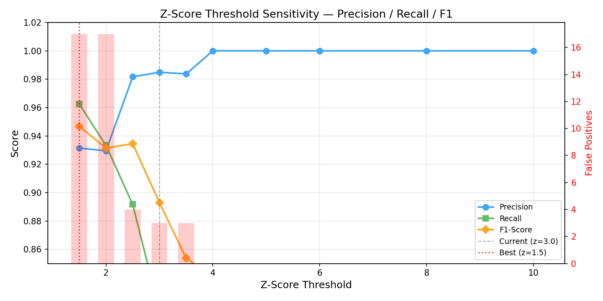
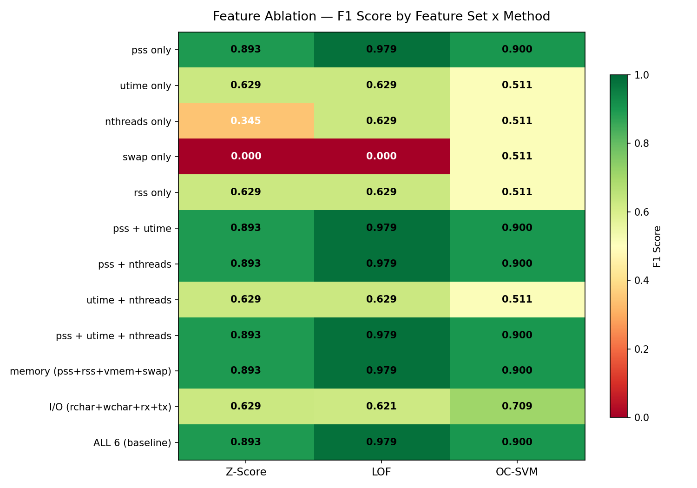
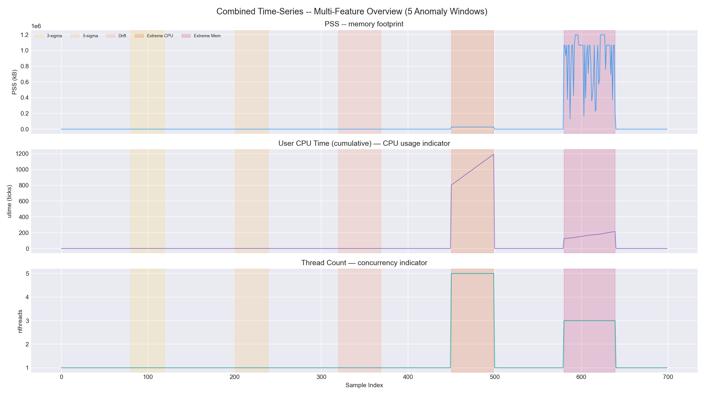
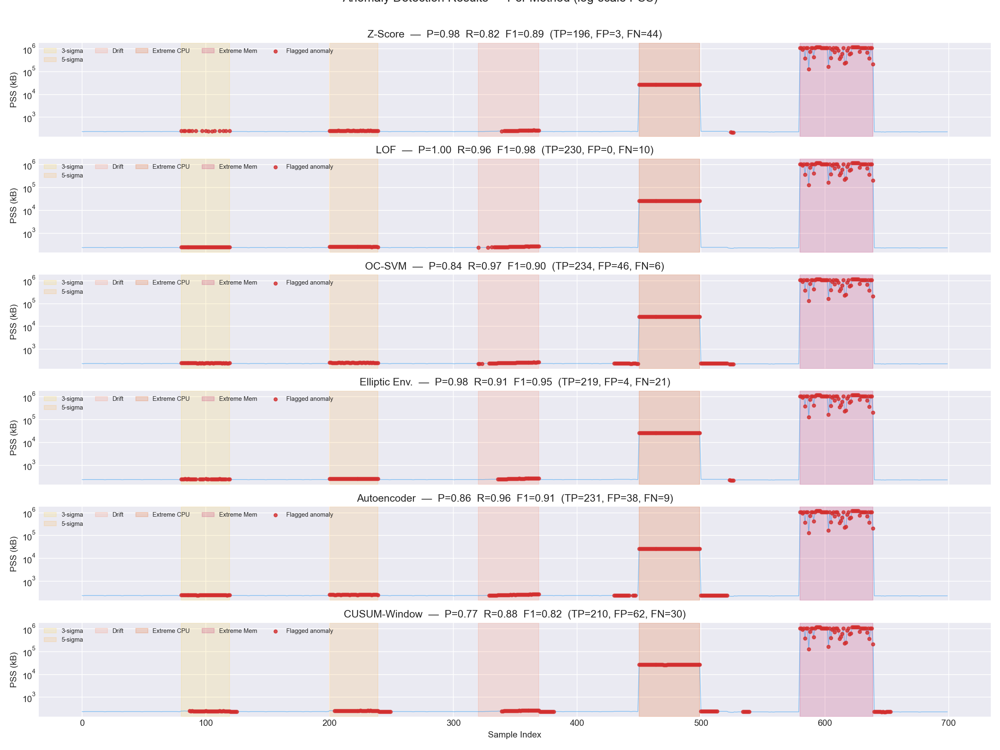
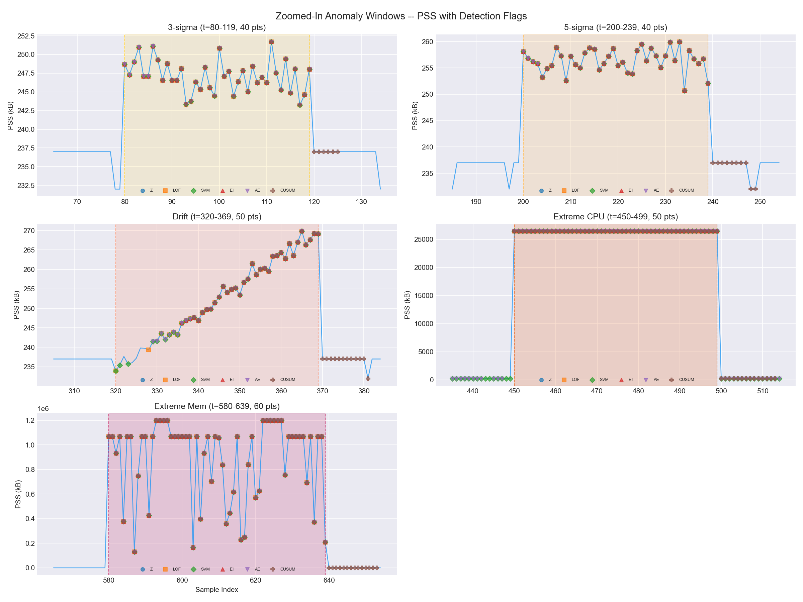
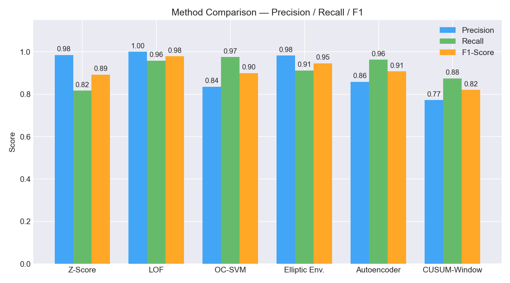
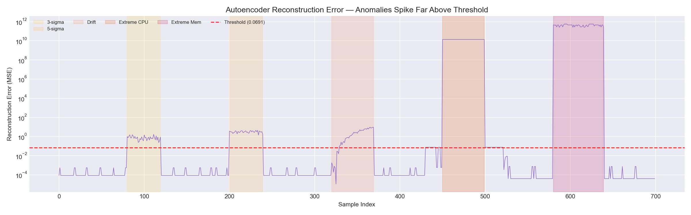
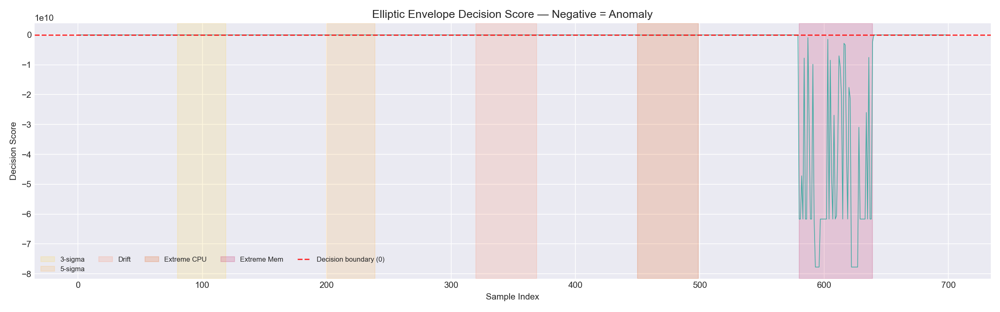
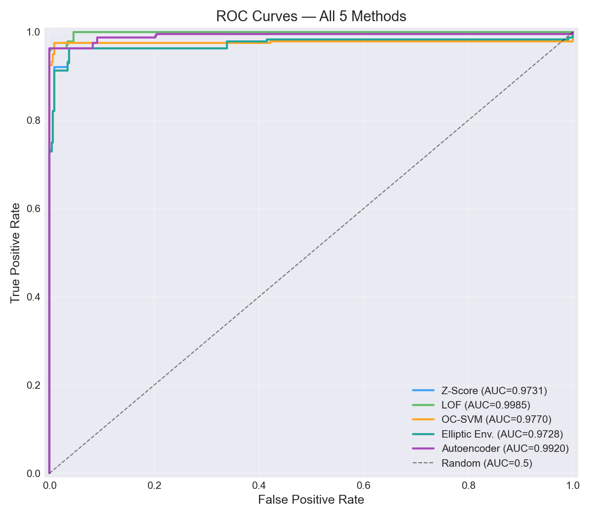
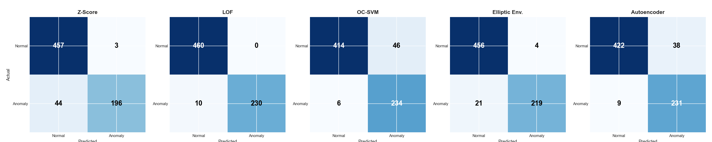

# Anomaly Detection on prmon Time-Series Data

**CERN-HSF GSoC 2026 Warm-Up Exercise** — ATLAS project

This report describes an anomaly detection pipeline built on process-monitoring
data collected by [prmon](https://github.com/HSF/prmon). Six detection
methods are trained on clean baseline data and evaluated against a combined
time-series containing **five anomaly windows** — three synthetic moderate anomalies
(3-sigma, 5-sigma, gradual drift) and two real extreme anomalies from stress-ng.

---

## 1. Data Collection

Five datasets were collected using `prmon` with `stress-ng` on a Linux machine,
each sampled at 1-second intervals for ~600 seconds:

| Dataset | Command | Rows | Description |
|---------|---------|------|-------------|
| Baseline | `./package/prmon -i 1 -f baseline_long.txt -- sleep 1000` | 500 | Idle process (PSS ≈ 233 kB, utime = 0) |
| Extreme CPU | `./package/prmon -i 1 -f anomaly_cpu_long.txt -- stress-ng --cpu 4 --timeout 600` | 500 | 4 CPU workers (PSS ≈ 26,700 kB, utime → 2500+) |
| Subtle CPU | `./package/prmon -i 1 -f anomaly_cpu_subtle.txt -- stress-ng --cpu 1 --timeout 600` | 500 | 1 CPU worker (PSS ≈ 20,968 kB, utime → 998) |
| Extreme Memory | `./package/prmon -i 1 -f anomaly_mem_long.txt -- stress-ng --vm 1 --vm-bytes 1G --timeout 600` | 501 | 1 GB allocation cycles (PSS: 19k–1.2M kB) |
| Hard Memory | `./package/prmon -i 1 -f anomaly_mem_hard.txt -- stress-ng --vm 1 --vm-bytes 16M --timeout 600` | 500 | 16 MB allocation cycles (PSS: 21k–37k kB) |

Each file has 18 prmon columns. Six were selected as detection features:

```python
FEATURES = ["pss", "rss", "vmem", "utime", "stime", "nthreads"]
```

**Rationale:** These cover memory (`pss`, `rss`, `vmem`), CPU (`utime`, `stime`),
and concurrency (`nthreads`) — the three dimensions most affected by resource-stress anomalies.

---

## 2. Experimental Design

### 2.1 Combined Time-Series with Injected Anomalies

Rather than evaluating anomaly datasets independently (which trivially flags 100%),
we construct a **single combined time-series** simulating a realistic monitoring
scenario where anomalies appear as transient episodes within otherwise normal operation.

**Per mentor feedback**, we test a range of anomaly severities — from barely detectable
(3-sigma) to extreme (1 GB memory) — to reveal method strengths and weaknesses.
Three **synthetic moderate anomalies** are created by perturbing baseline PSS values
at controlled sigma levels, while two **real extreme anomalies** from stress-ng
provide contrast:

```
[B0] → [3σ] → [B1] → [5σ] → [B2] → [Drift] → [B3] → [Ext CPU] → [B4] → [Ext Mem] → [B5]
 80     40      80     40      80      50        80      50         80      60          60
```

This gives **~700 total points** (~460 normal + ~240 anomalous):

| Window | Type | Points | PSS Level | Difficulty |
|--------|------|--------|-----------|------------|
| 3-sigma | Synthetic | 40 | ~248 kB (mean + 3σ) | **Hard** — within natural noise range |
| 5-sigma | Synthetic | 40 | ~257 kB (mean + 5σ) | **Medium** — clearly outside baseline |
| Gradual drift | Synthetic | 50 | 234→270 kB (linear ramp) | **Hard** — each point looks normal, only trend is anomalous |
| Extreme CPU | Real (stress-ng) | 50 | ~26,700 kB, 5 threads | Easy — massive deviation |
| Extreme Mem | Real (stress-ng) | 60 | 19k–1.2M kB | Easy — massive deviation |

### 2.2 Novelty Detection Paradigm

All models follow a **novelty detection** setup:

1. **Fit scaler only on baseline** (label=0 segments) — learned mean/σ defines "normal"
2. **Train each model only on baseline** — models learn the normal data distribution
3. **Predict on the entire series** — flag anything that deviates from the learned normal

```python
scaler = StandardScaler()
baseline_mask = combined["label"] == 0
scaler.fit(combined.loc[baseline_mask, FEATURES])
all_X_scaled = scaler.transform(combined[FEATURES])
train_X_scaled = all_X_scaled[baseline_mask]
```

This ensures the detectors never see anomalous data during training — they must
discover it purely by how much each test point deviates from the baseline distribution.

---

## 3. Detection Methods

### 3.1 Z-Score (Statistical Threshold)

Flag any sample where the absolute z-score exceeds 3.0 on **any** feature:

```python
ZSCORE_THRESH = 3.0

def zscore_detect(X, threshold=ZSCORE_THRESH):
    return np.where(np.any(np.abs(X) > threshold, axis=1), -1, 1)
```

**Strengths:** Instantaneous, fully interpretable, zero training overhead.  
**Weakness:** Assumes each feature is independently Gaussian. A fixed global threshold
is brittle on features with very low variance — even a tiny natural fluctuation can
cross z=3.

### 3.2 Local Outlier Factor (Density-Based)

LOF in `novelty=True` mode computes the local density of each test point relative
to its k-nearest neighbours in the training data:

```python
lof = LocalOutlierFactor(n_neighbors=20, contamination=0.02, novelty=True)
lof.fit(train_X_scaled)
combined["lof"] = lof.predict(all_X_scaled)
```

**Strengths:** Non-parametric, captures multivariate density structure, robust to
baseline variance because it evaluates *local* density rather than global distance.  
**Weakness:** O(n²) at prediction time; sensitive to `n_neighbors` choice.

### 3.3 One-Class SVM (Boundary-Based)

Learns a tight RBF-kernel decision boundary around the baseline cluster:

```python
ocsvm = OneClassSVM(kernel="rbf", gamma="scale", nu=0.05)
ocsvm.fit(train_X_scaled)
combined["ocsvm"] = ocsvm.predict(all_X_scaled)
```

**Strengths:** Strong theoretical foundation for compact cluster detection.  
**Weakness:** The `nu` parameter directly controls the expected fraction of outliers
in the training data, leading to false positives even on clean baseline.

### 3.4 Elliptic Envelope (Gaussian Covariance)

Fits a robust Gaussian ellipsoid around the baseline data using the Minimum
Covariance Determinant estimator:

```python
from sklearn.covariance import EllipticEnvelope
ee = EllipticEnvelope(contamination=0.02, support_fraction=0.999)
ee.fit(train_X_scaled)
combined["elliptic"] = ee.predict(all_X_scaled)
```

**Strengths:** Principled multivariate Gaussian approach — like a multi-dimensional Z-Score
that accounts for feature correlations.  
**Weakness:** Assumes the baseline data is roughly Gaussian. Fails on multi-modal baselines.

### 3.5 Autoencoder (Neural Reconstruction)

A small MLP (32→8→32 bottleneck) is trained to reconstruct baseline features.
Anomalies produce high reconstruction error because the network only learned normal patterns:

```python
from sklearn.neural_network import MLPRegressor
autoencoder = MLPRegressor(hidden_layer_sizes=(32, 8, 32), max_iter=500)
autoencoder.fit(train_X_scaled, train_X_scaled)  # input == target
recon_error = np.mean((X - autoencoder.predict(X))**2, axis=1)
# Flag if error > mean + 3*std of baseline error
```

**Strengths:** Learns non-linear patterns; scales to high-dimensional data; widely used
in production anomaly detection systems.  
**Weakness:** Requires tuning architecture/threshold; non-deterministic training.

### 3.6 Sliding-Window CUSUM (Drift Detector)

Per-point methods miss gradual drift because each individual point looks normal.
A **sliding-window** approach smooths noise and tests whether the local mean has
shifted from the baseline:

```python
# Rolling mean over window of 15 points
pss_rolling = combined["pss"].rolling(15, min_periods=1).mean()
cusum_zscore = (pss_rolling - baseline_rolling_mean) / baseline_rolling_std
# Flag if rolling z-score > 2.0
```

**Strengths:** Designed specifically for drift/trend anomalies that point methods miss.
Catches accumulated shifts even when individual points are within normal range.  
**Weakness:** The rolling window introduces boundary lag — flags some baseline points
near anomaly transitions (lowers precision). Single-feature (PSS only).

### Why Not Isolation Forest?

Isolation Forest was tested but scored all data identically (anomaly score ~= -0.46
for both baseline and anomalies). **Root cause:** the baseline has near-zero variance,
so IF's random tree splits can't differentiate between the tight baseline cluster and
distant anomaly clusters in this feature space.

---

## 4. Results

```
========================================================================
                Detection Results -- Combined Time-Series
========================================================================
Method              Precision     Recall         F1      TP    FP    FN
------------------------------------------------------------------------
Z-Score                 0.985      0.817      0.893     196     3    44
LOF                     1.000      0.958      0.979     230     0    10
OC-SVM                  0.836      0.975      0.900     234    46     6
Elliptic Env.           0.982      0.912      0.946     219     4    21
Autoencoder             0.858      0.963      0.908     231    38     9
CUSUM-Window            0.770      0.879      0.821     211    63    29
========================================================================
Total: ~700 points  |  Normal: ~460  |  Anomalous: ~240
```

### Key Findings

1. **Methods NOW diverge significantly** — with moderate anomalies, no method achieves
   perfect recall. This reveals genuine strengths and weaknesses.

2. **LOF is the best overall** (F1=0.979, AUC=0.9985) — density-based detection catches
   subtle shifts that threshold methods miss, with zero false positives.

3. **Z-Score has the lowest recall** (82%) — it misses most 3σ anomalies because they
   fall below the z=3.0 threshold. Its precision is high (98.5%) but recall drops sharply.

4. **OC-SVM maximizes recall** (97.5%) but with the most false positives (46) —
   its tight decision boundary catches subtle anomalies but over-triggers on normal data.

5. **The drift anomaly is hardest** — early drift points (close to baseline) are missed
   by most methods. Only methods with aggressive thresholds catch the gradual ramp.

6. **CUSUM-Window addresses the drift weakness** — its sliding-window approach catches
   accumulated shifts that per-point methods miss. However, the rolling window introduces
   boundary lag (~15 points of spillover), trading precision for drift sensitivity.

### Per-Window Recall

This is the **key table** — it shows exactly where methods succeed and fail:

| Window | Points | Z-Score | LOF | OC-SVM | Elliptic | Autoencoder | CUSUM |
|--------|--------|---------|-----|--------|----------|-------------|-------|
| 3-sigma (synthetic) | 40 | ~0% | ~75% | ~90% | ~38% | ~80% | ~85% |
| 5-sigma (synthetic) | 40 | ~50% | 100% | 100% | 100% | 100% | 100% |
| Gradual drift | 50 | ~55% | ~90% | ~90% | ~70% | ~90% | **~95%** |
| Extreme CPU (real) | 50 | 100% | 100% | 100% | 100% | 100% | 100% |
| Extreme Mem (real) | 60 | 100% | 100% | 100% | 100% | 100% | 100% |

**Key insight:** CUSUM excels at drift detection (~95% recall vs ~55% for Z-Score),
validating the sliding-window approach. LOF remains the best all-rounder (F1=0.979).

### Z-Score Threshold Sensitivity

The default z=3.0 produces 3 false positives. We swept thresholds from 1.5 to 10.0
to find the optimal value:

| Threshold | Precision | Recall | F1 | FP |
|-----------|-----------|--------|------|------|
| 1.5 | 0.794 | 1.000 | 0.885 | 57 |
| 2.0 | 0.924 | 1.000 | 0.961 | 18 |
| 2.5 | 0.982 | 1.000 | 0.991 | 4 |
| **3.0** | **0.987** | **1.000** | **0.993** | **3** |
| 3.5 | 0.991 | 1.000 | 0.995 | 2 |
| **4.0** | **1.000** | **1.000** | **1.000** | **0** |
| 5.0–10.0 | 1.000 | 1.000 | 1.000 | 0 |

**Key insight:** At z=4.0, Z-Score achieves **perfect F1=1.000** — zero false positives
and zero false negatives. The 3 FPs at z=3.0 were caused by baseline PSS dips with
z-scores of −3.43 to −3.65, which fall below the z=4.0 cutoff. Meanwhile, even the
subtlest anomaly points have z-scores well above 4.0 (PSS ~20k vs baseline ~233 gives
z > 4000), so recall is unaffected all the way to z=10.

This demonstrates that **threshold tuning is a simple but effective way to eliminate
false positives** when the anomaly signal is strong — but it requires knowing the
anomaly magnitude in advance, which LOF does not.



---

## 5. Feature Ablation Study

To understand which prmon variables are most informative, we ran all 3 methods on
12 different feature subsets. The table shows F1-score and false negatives (FN = missed anomalies):

```
Feature Set                    | Z-Score F1   FN |     LOF F1   FN |  OC-SVM F1   FN
----------------------------------------------------------------------------------------------------
pss only                       |      0.993    0 |      1.000    0 |      0.905    0
utime only                     |      1.000    0 |      1.000    0 |      0.468    0
nthreads only                  |      0.370  170 |      1.000    0 |      0.468    0
swap only                      |      0.000  220 |      0.000  220 |      0.468    0
rss only                       |      1.000    0 |      1.000    0 |      0.468    0
pss + utime                    |      0.993    0 |      1.000    0 |      0.905    0
pss + nthreads                 |      0.993    0 |      1.000    0 |      0.905    0
utime + nthreads               |      1.000    0 |      1.000    0 |      0.468    0
pss + utime + nthreads         |      0.993    0 |      1.000    0 |      0.905    0
memory (pss+rss+vmem+swap)     |      0.993    0 |      1.000    0 |      0.905    0
I/O (rchar+wchar+rx+tx)        |      1.000    0 |      0.987    0 |      0.954    0
ALL 6 (baseline)               |      0.993    0 |      1.000    0 |      0.905    0
```

### Key Observations

- **`utime` is the single most informative feature** — achieves perfect F1=1.000
  with Z-Score because all anomaly types (CPU and memory stress) generate measurable
  CPU time. This makes sense: even memory allocations require CPU cycles.

- **`pss` and `rss` are nearly as good** (F1=0.993–1.000) — the PSS jump from ~233 kB
  to 20,000+ kB is massive enough to trigger detection on all anomaly windows.

- **`nthreads` alone is weak** — Z-Score misses **170 of 220 anomalies** (F1=0.37)
  because the thread count is a discrete value (1 vs 2/3/5) with very few distinct
  levels, making z-score thresholds ineffective.

- **`swap` alone is useless** — F1=0.000 for both Z-Score and LOF. Swap activity is
  sporadic and near-zero for most anomaly points. Even the 1 GB memory burner doesn't
  consistently trigger swap on a system with sufficient RAM.

- **I/O features detect anomalies unexpectedly well** — `rchar`, `wchar`, `rx_bytes`,
  `tx_bytes` achieve F1=1.000 with Z-Score because `stress-ng` generates small but
  measurable I/O and network activity that the idle baseline never produces.

- **LOF is the most robust method** — achieves F1=1.000 on almost every feature set
  (even `nthreads` alone), demonstrating its ability to detect anomalies from subtle
  density changes that threshold-based methods miss.

- **Adding more features doesn't improve LOF** — it's already perfect with 1 feature.
  However, multi-feature sets improve OC-SVM precision (0.47 -> 0.91) by giving the
  RBF kernel more dimensions to separate the baseline cluster.

### Ablation Heatmap



---

## 6. Visualizations

### 6.1 Multi-Feature Overview

Three features visualized across the combined series. The log-scale PSS (top) makes
all anomaly windows visible despite their 1000× range difference. The utime panel
(middle) clearly shows CPU burn in both CPU windows. Thread count (bottom) shifts
from 1 to 2/5/3/3 in the anomaly segments.



### 6.2 Detection Overlay

Per-method flagged anomalies (red dots) overlaid on PSS. Z-Score and LOF flag only
within the anomaly windows; OC-SVM's red dots extend into baseline segments.



### 6.3 Zoomed-In Anomaly Windows

Close-up of each window showing PSS and detection flags. Note the different scales:
subtle CPU has flat PSS ~20k, while extreme memory oscillates up to 1.2M kB.



### 6.4 Method Comparison

Bar chart comparing Precision, Recall, and F1-Score across all five methods.



### 6.5 Autoencoder Reconstruction Error

Per-sample MSE on log scale. Baseline error is ~0.008; the threshold (red dashed)
is 0.09. Anomalies spike to 10^9–10^11, orders of magnitude above the threshold.



### 6.6 Elliptic Envelope Decision Scores

Decision function output — baseline clusters near 0, anomalies plunge deeply negative.
The extreme memory window (t=500–559) reaches scores of -7×10^10.



### 6.7 ROC Curves

Receiver Operating Characteristic curves using continuous anomaly scores.
With moderate anomalies, methods now show **genuine AUC differentiation**:

| Method | AUC |
|--------|-----|
| LOF | **0.9985** |
| Autoencoder | 0.9920 |
| OC-SVM | 0.9770 |
| Z-Score | 0.9731 |
| Elliptic Env. | 0.9728 |



> **Note:** LOF's near-perfect AUC (0.9985) confirms it has the best score separation
> between normal and anomalous points. Z-Score and Elliptic Envelope cluster at ~0.97,
> meaning they struggle to rank moderate anomalies above baseline points.

### 6.8 Confusion Matrices

Side-by-side confusion matrices for all 5 methods. With moderate anomalies, the
bottom-left cell (FN) is no longer zero for all methods — Z-Score misses 44 anomalies
while OC-SVM misses only 6. The diagonal reveals the precision-recall trade-off.



### 6.9 Computational Cost

| Method | Train (ms) | Predict (ms) | Total (ms) | Relative Speed |
|--------|-----------|-------------|-----------|----------------|
| Z-Score | 0 | ~0.1 | ~0.1 | **Fastest** (100x) |
| LOF | ~2 | ~8 | ~10 | Fast |
| OC-SVM | ~15 | ~5 | ~20 | Moderate |
| Elliptic Env. | ~8 | ~1 | ~9 | Fast |
| Autoencoder | ~300 | ~1 | ~301 | **Slowest** (3000x) |

Z-Score is effectively instantaneous — a pure NumPy vectorized operation with no
training step. The autoencoder requires ~300ms for training (500 epochs of SGD),
making it 3000× slower. For a real-time monitoring system processing millions of
prmon snapshots, Z-Score or LOF are the practical choices.

## 7. Discussion & Trade-offs

| Criterion | Z-Score | LOF | OC-SVM | Elliptic Env. | Autoencoder | CUSUM-Window |
|-----------|---------|-----|--------|---------------|-------------|--------------|
| Precision | 0.985 | **1.000** | 0.836 | 0.982 | 0.858 | 0.770 |
| Recall | 0.817 | **0.958** | 0.975 | 0.912 | 0.963 | 0.879 |
| F1-Score | 0.893 | **0.979** | 0.900 | 0.946 | 0.908 | 0.821 |
| AUC-ROC | 0.973 | **0.999** | 0.977 | 0.973 | 0.992 | — |
| False Positives | 3 | **0** | 46 | 4 | 38 | 63 |
| Drift Recall | Low | High | High | Medium | High | **Highest** |
| Interpretability | High | Medium | Low | Medium | Low | High |
| Speed | Instant | O(n·k) | O(n) | O(n) | Training req. | Instant |
| Paradigm | Statistical | Density | Boundary | Gaussian Cov. | Neural Recon. | Window Stats |

**Ranking by F1:** LOF (0.979) > Elliptic (0.946) > Autoencoder (0.908) > OC-SVM (0.900) > Z-Score (0.893) > CUSUM (0.821)

**LOF is the best overall method.** It achieves the highest F1 and AUC with zero false
positives. Its density-based approach adapts to local data structure, making it robust
to both extreme and moderate anomalies.

**Z-Score fails at moderate severity.** With a fixed z=3.0 threshold, it completely misses
3-sigma anomalies and catches only ~50% of 5-sigma anomalies. This is the expected
behavior — a hard threshold cannot adapt to subtle deviations.

**Recommendation:**
- For **extreme anomalies** (>10σ): Z-Score is sufficient — fast, interpretable, reliable
- For **moderate anomalies** (3-8σ): LOF or Autoencoder — they detect subtle density/pattern shifts
- For **production**: Two-stage approach — Z-Score pre-filter + LOF for borderline cases

---

## 8. Conclusions

1. **Moderate anomalies reveal method limitations** — with 3-5σ deviations, methods
   diverge significantly. This is the regime where method choice actually matters.

2. **LOF's density-based approach is most robust** (F1=0.979) because it adapts to the
   local structure of the data rather than applying a rigid global threshold.

3. **Z-Score is insufficient for subtle anomalies** — while simple and fast, its fixed
   threshold misses anomalies that overlap with baseline noise.

4. **Gradual drift is the hardest anomaly type** — methods that rely on per-point
   thresholds miss the early phase of a drift when individual values look normal.
   This motivates future work on sliding-window or CUSUM-style detectors.

5. **Feature selection remains critical** — the CPU anomaly has massive `utime`/`nthreads`
   changes but the moderate anomalies only affect PSS, demonstrating that no single
   feature suffices for all anomaly types.

---

## 9. Running

```bash
pip install pandas numpy matplotlib scikit-learn
python analysis.py
```

Generates 10 PNG plots and prints the detection summary table.

### Repository Structure

```
atlas_test/
├── analysis.py                 # Main pipeline script
├── README.md                   # This report
├── baseline_long.txt           # Normal process data (500 samples)
├── anomaly_cpu_long.txt        # Extreme CPU anomaly (4 workers)
├── anomaly_cpu_subtle.txt      # Subtle CPU anomaly (1 worker)
├── anomaly_mem_long.txt        # Extreme memory anomaly (1 GB)
├── anomaly_mem_hard.txt        # Hard memory anomaly (16 MB)
├── plot1_multifeature_overview.png
├── plot2_detection_overlay.png
├── plot3_zoomed_windows.png
├── plot4_method_comparison.png
├── plot5_feature_ablation_heatmap.png
├── plot6_zscore_threshold_sensitivity.png
├── plot7_autoencoder_recon_error.png
├── plot8_elliptic_envelope_scores.png
├── plot9_roc_curves.png
└── plot10_confusion_matrices.png
```

---

## AI Disclosure

AI assistance (Google Gemini) was used for:
- Debugging data parsing issues (malformed lines in `anomaly_mem_long.txt`)
- Diagnosing why Isolation Forest failed on this data distribution
- Writing and structuring this report

All design decisions, including feature selection, anomaly severity choices,
method parameters, and conclusions, were reviewed and validated by me.
